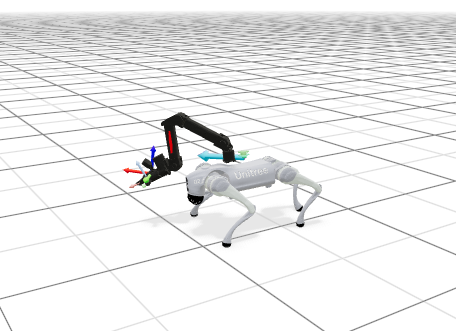
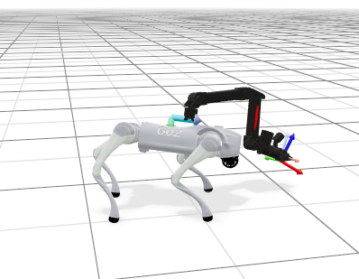
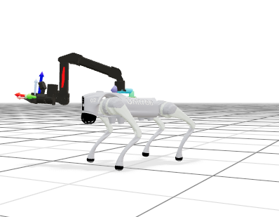
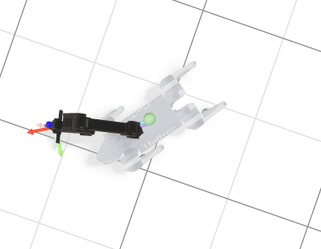

# Go2_ARX_mjlab

<p align="center">
  
</p>

<p align="center">
  
  
  
</p>

Go2_ARX_mjlab adds a Unitree Go2 + ARX L5 arm robot to
[mjlab](https://github.com/mujocolab/mjlab), with reinforcement-learning tasks
for base velocity tracking and end-effector pose tracking.

This repository includes:

- a combined Go2 + ARX L5 MuJoCo XML model
- position-control actions for the Go2 legs and ARX arm
- end-effector pose commands for the arm
- base velocity commands for the quadruped
- flat and rough terrain task registrations

## Tasks

The added task IDs are:

```bash
Mjlab-Velocity-Flat-Go2arm
Mjlab-Velocity-Rough-Go2arm
```

Main implementation files:

```text
src/mjlab/asset_zoo/robots/go2arm/
src/mjlab/tasks/velocity/config/go2arm/
src/mjlab/tasks/velocity/mdp/go2arm_lab.py
```

## Installation

This project uses the same setup as mjlab. From the repository root:

```bash
uv sync
```

Training requires an NVIDIA GPU.

## Sanity Check

Run the environment with zero actions:

```bash
uv run play Mjlab-Velocity-Flat-Go2arm \
  --agent zero \
  --viewer viser \
  --num-envs 1
```

Run the environment with random actions:

```bash
uv run play Mjlab-Velocity-Flat-Go2arm \
  --agent random \
  --viewer viser \
  --num-envs 1
```

Open the Viser viewer at:

```text
http://localhost:8080
```

## Training

You can use either Weights & Biases or TensorBoard for logging. The commands
below use TensorBoard for demonstration.

Train on flat terrain:

```bash
uv run train Mjlab-Velocity-Flat-Go2arm \
  --env.scene.num-envs 4096 \
  --agent.logger tensorboard
```

Train on rough terrain:

```bash
uv run train Mjlab-Velocity-Rough-Go2arm \
  --env.scene.num-envs 4096 \
  --agent.logger tensorboard
```

To resume from a local checkpoint:

```bash
uv run train Mjlab-Velocity-Flat-Go2arm \
  --env.scene.num-envs 4096 \
  --agent.resume True \
  --agent.load-run RUN_DIRECTORY_NAME \
  --agent.load-checkpoint model_1000.pt \
  --agent.logger tensorboard
```

Example:

```bash
uv run train Mjlab-Velocity-Flat-Go2arm \
  --env.scene.num-envs 4096 \
  --agent.resume True \
  --agent.load-run 2026-05-17_21-41-04 \
  --agent.load-checkpoint model_200.pt \
  --agent.logger tensorboard
```

## Play a Trained Policy

Play a checkpoint:

```bash
uv run play Mjlab-Velocity-Flat-Go2arm \
  --checkpoint-file /path/to/model.pt \
  --viewer viser \
  --num-envs 1
```

Example:

```bash
uv run play Mjlab-Velocity-Flat-Go2arm \
  --checkpoint-file logs/rsl_rl/unitree_Go2arm_flat/RUN_DIRECTORY/model_1000.pt \
  --viewer viser \
  --num-envs 1
```

For visualization-only debugging, you can disable terminations:

```bash
uv run play Mjlab-Velocity-Flat-Go2arm \
  --checkpoint-file /path/to/model.pt \
  --viewer viser \
  --num-envs 1 \
  --no-terminations True
```

## Deployment

Deployment support is currently in progress. The deployment code and
instructions will be open-sourced as soon as they are ready.

## Commands and Actions

The policy receives two commands:

- `base_velocity`: desired base linear and yaw velocity
- `ee_pose`: desired end-effector pose, represented as
  `(x, y, z, qw, qx, qy, qz)`

The action space has 18 dimensions:

- 12 Go2 leg joint position targets
- 6 ARX L5 arm joint position targets

## Assets

Robot assets include Unitree Go2 and ARX L5 resources. See the included license
files:

```text
src/mjlab/asset_zoo/robots/go2arm/xmls/unitree_go2/LICENSE
src/mjlab/asset_zoo/robots/go2arm/xmls/arx_l5/LICENSE
```

## Acknowledgments

This project is built on top of the
[mjlab](https://github.com/mujocolab/mjlab) framework. Many thanks to the mjlab
authors and contributors for making this work possible.

The reinforcement-learning task design and algorithm setup reference
[Go2Arm_Lab](https://github.com/zzzJie-Robot/Go2Arm_Lab). We sincerely thank
the authors for their open-source work.

## License

This repository is based on mjlab and keeps the original Apache-2.0 license.
See [LICENSE](LICENSE).

Third-party assets and code retain their original licenses. In particular,
check the license files bundled with the Go2 and ARX L5 assets before using them
in commercial or redistributed projects.

If you use the underlying mjlab framework in research, please also cite the
original mjlab project.
